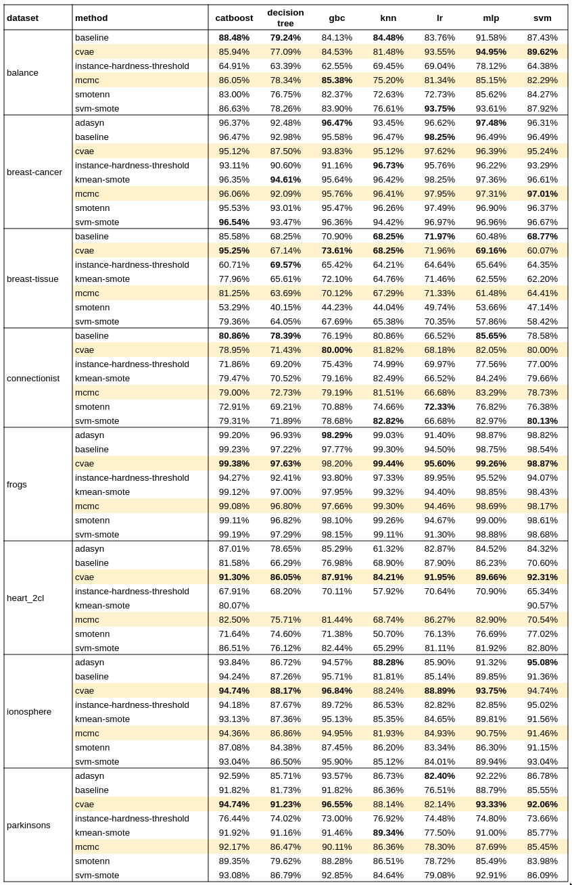

# Conditional VAE & MCMC for imbalance learning
Minority class oversampling using conditional VAE and MCMC

## TLDR

Oversampling


### MCMC

To sample from from class $c_i$ with probability density function $p(X | y = c_i)$, we can utilize Markov Chain Monte Carlo, we need quantity:

$$
\begin{equation}
\begin{aligned}
H & = \frac{p(x | y = c_i)}{p(x_t | y = c_i)} \\ 
    & = \frac{p(x, y)/p(y)}{p(x_t, y)/p(y)} \\
    & = \frac{p(y|x)}{p(y|x_t)} \times \frac{p(x)}{p(x_t)}
\end{aligned}
\end{equation}
$$

The first term $p(y | x)$, we can train a classifier to approximate this quantity. The choice of $d_\theta(.)$ is very flexible, can be `scikit-learn` implementation of `LogisticRegression()` for binary classification problem or a simple fully connected network.

$$
p(y | x) = d_\theta(x)
$$


For the second term, we can just assume x to be  a parametrics distribution such as Multivariate Gaussian. 

$$
x \sim \mathcal{N}(.; \mu, \Sigma)
$$


## Conditional VAE


## RESULTS 


## Checklist

### Dataset

- [x] Breast Cancer
- [x] Frogs MFCCs
- [x] Breast Tissue
- [x] Connectionist BenchMark
- [x] Ionosphere
- [x] Parkinsons
- [ ] Heart Training Subset ( Heart2CL? )
- [x] Balance

Other (not included in Hoang's repo)

- [x] Ecoli

### Classifier

- [x] SMV
- [x] Logistic Regression
- [x] MLP

Other:

- [x] KNN
- [x] Decision Tree
- [x] Gradient Boosting Classifier
- [x] CatBoost


## [IMPORTANT] Experiment procedure

### Validation method

- For `sklearn.model_selection.train_test_split`, set `random_state=1`, `stratify=y`.
- ...


## Commands

- Train a CVAE model to generate random samples from any class

```bash
    python -m modules.cvae.train --config <pth/to/config>
```

- CVAE oversampling experiment

```bash
    python -m modules.cvae --config <pth/to/config>
```

For sample of config file, see `config/dev.yaml`

- Reproduce all experiments

```bash
    make all
```

## Note/Questions
- **Breast tissues**: Is the baseline result trained on Scaled Dataset?
- **Heart 2CL dataset**: training on spectf.data as train and spectf.test as validation or concate and split later( as in Thu's [notebook](https://colab.research.google.com/drive/1zm-V7dIAE5F61NxAcNASD9WBR1YzJXcv?usp=sharing#scrollTo=8-kXWlmtl-OM)?)

- **MLP**: where is the code for implementations?

## Citations

```bibtex
{
}
```


## Resource

- [Notebook](https://colab.research.google.com/drive/1zm-V7dIAE5F61NxAcNASD9WBR1YzJXcv?usp=sharing#scrollTo=pvXSYmgVoP9D) handling dataset
- [Hoang's repo](https://github.com/Cavan1Ed1s0n/MissingData/)
