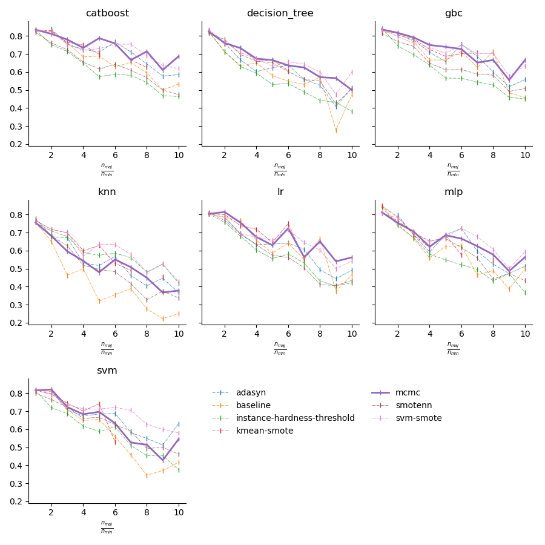
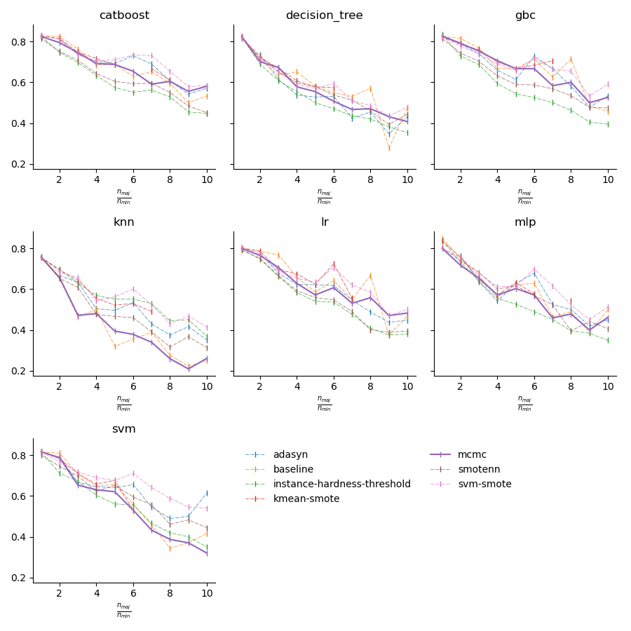

# Conditional VAE & MCMC for imbalance learning
Minority class oversampling using conditional VAE and MCMC

## TLDR

Oversampling


### MCMC

To sample from from class $c_i$ with probability density function $p(X | y = c_i)$, we can utilize Markov Chain Monte Carlo, we need quantity:

$$
\begin{equation}
\begin{aligned}
H & = \frac{p(x | y = c_i)}{p(x_t | y = c_i)} \\ 
    & = \frac{p(x, y)/p(y)}{p(x_t, y)/p(y)} \\
    & = \frac{p(y|x)}{p(y|x_t)} \times \frac{p(x)}{p(x_t)}
\end{aligned}
\end{equation}
$$

The first term $p(y | x)$, we can train a classifier to approximate this quantity. The choice of $d_\theta(.)$ is very flexible, can be `scikit-learn` implementation of `LogisticRegression()` for binary classification problem or a simple fully connected network.

$$
p(y | x) = d_\theta(x)
$$


For the second term, we can just assume x to be  a parametrics distribution such as Multivariate Gaussian. 

$$
x \sim \mathcal{N}(.; \mu, \Sigma)
$$


### Comparing result at different degree of imbalance
**Average result over 15 runs**


**Best result in 15 runs**


## Checklist

### Dataset

- [x] Breast Cancer
- [x] Frogs MFCCs
- [x] Breast Tissue
- [x] Connectionist BenchMark
- [x] Ionosphere
- [x] Parkinsons
- [ ] Heart Training Subset ( Heart2CL? )
- [x] Balance

Other (not included in Hoang's repo)

- [x] Ecoli

### Classifier

- [x] SMV
- [x] Logistic Regression
- [x] MLP

Other:

- [x] KNN
- [x] Decision Tree
- [x] Gradient Boosting Classifier
- [x] CatBoost


## Conditional VAE


## RESULTS 
| dataset       | classifier    |   adasyn |   baseline |   instance-hardness-threshold |   kmean-smote |     mcmc |   smotenn |   svm-smote |
|---------------|---------------|----------|------------|-------------------------------|---------------|----------|-----------|-------------|
| balance       | catboost      | 0        |    0.71001 |                      0.542369 |      0        | 0.646565 |  0.710061 |    0.663022 |
| balance       | decision_tree | 0        |    0.59377 |                      0.513811 |      0        | 0.573965 |  0.606283 |    0.589603 |
| balance       | gbc           | 0        |    0.60965 |                      0.528087 |      0        | 0.635381 |  0.655518 |    0.609042 |
| balance       | knn           | 0        |    0.64113 |                      0.565335 |      0        | 0.582711 |  0.618299 |    0.564004 |
| balance       | lr            | 0        |    0.60709 |                      0.585141 |      0        | 0.701923 |  0.614043 |    0.863339 |
| balance       | mlp           | 0        |    0.75546 |                      0.666998 |      0        | 0.713779 |  0.745214 |    0.84783  |
| balance       | svm           | 0        |    0.63367 |                      0.540209 |      0        | 0.662032 |  0.724119 |    0.743762 |
| breast-cancer | catboost      | 0.9623   |    0.96191 |                      0.926015 |      0.961258 | 0.955561 |  0.953085 |    0.967881 |
| breast-cancer | decision_tree | 0.928347 |    0.9246  |                      0.901623 |      0.936709 | 0.920275 |  0.932797 |    0.929733 |
| breast-cancer | gbc           | 0.965633 |    0.95213 |                      0.907239 |      0.95213  | 0.951628 |  0.952892 |    0.954213 |
| breast-cancer | knn           | 0.931063 |    0.96191 |                      0.966761 |      0.957584 | 0.96191  |  0.959788 |    0.939891 |
| breast-cancer | lr            | 0.9645   |    0.98115 |                      0.952334 |      0.98115  | 0.979874 |  0.973081 |    0.96818  |
| breast-cancer | mlp           | 0.974705 |    0.9623  |                      0.957182 |      0.974132 | 0.971657 |  0.971113 |    0.970549 |
| breast-cancer | svm           | 0.959724 |    0.9623  |                      0.933711 |      0.964156 | 0.964775 |  0.961656 |    0.963599 |
| breast-tissue | catboost      | 0        |    0.84762 |                      0.623166 |      0.758553 | 0.811975 |  0.507267 |    0.773977 |
| breast-tissue | decision_tree | 0        |    0.65212 |                      0.653323 |      0.607375 | 0.638702 |  0.42913  |    0.621792 |
| breast-tissue | gbc           | 0        |    0.68191 |                      0.577565 |      0.656546 | 0.675549 |  0.374536 |    0.646973 |
| breast-tissue | knn           | 0        |    0.66402 |                      0.628467 |      0.670017 | 0.656393 |  0.460533 |    0.641377 |
| breast-tissue | lr            | 0        |    0.69444 |                      0.630314 |      0.657291 | 0.699955 |  0.503415 |    0.66933  |
| breast-tissue | mlp           | 0        |    0.5787  |                      0.65     |      0.583527 | 0.605479 |  0.504445 |    0.578431 |
| breast-tissue | svm           | 0        |    0.65291 |                      0.60856  |      0.645837 | 0.594484 |  0.447018 |    0.579795 |
| connectionist | catboost      | 0        |    0.80778 |                      0.715469 |      0.79234  | 0.797088 |  0.723803 |    0.789239 |
| connectionist | decision_tree | 0        |    0.78462 |                      0.714983 |      0.719026 | 0.709695 |  0.719456 |    0.72194  |
| connectionist | gbc           | 0        |    0.76136 |                      0.751307 |      0.784825 | 0.792684 |  0.72163  |    0.794456 |
| connectionist | knn           | 0        |    0.80778 |                      0.743421 |      0.8226   | 0.80778  |  0.742107 |    0.834036 |
| connectionist | lr            | 0        |    0.66591 |                      0.700376 |      0.667536 | 0.670761 |  0.723555 |    0.66591  |
| connectionist | mlp           | 0        |    0.85584 |                      0.772485 |      0.840267 | 0.835455 |  0.751372 |    0.832299 |
| connectionist | svm           | 0        |    0.78559 |                      0.777494 |      0.79821  | 0.795017 |  0.760341 |    0.788745 |
| ecoli         | catboost      | 0.904275 |    0.91447 |                      0.829107 |      0.91447  | 0        |  0.89396  |    0.883501 |
| ecoli         | decision_tree | 0.845657 |    0.82011 |                      0.783103 |      0.89154  | 0        |  0.861275 |    0.854428 |
| ecoli         | gbc           | 0.854956 |    0.85376 |                      0.810339 |      0.893181 | 0        |  0.868471 |    0.858173 |
| ecoli         | knn           | 0.846863 |    0.89555 |                      0.91095  |      0.89555  | 0        |  0.91705  |    0.87895  |
| ecoli         | lr            | 0.837179 |    0.74702 |                      0.871885 |      0.842939 | 0        |  0.87215  |    0.820642 |
| ecoli         | mlp           | 0.862204 |    0.79762 |                      0.900583 |      0.878649 | 0        |  0.876766 |    0.871017 |
| ecoli         | svm           | 0.89555  |    0.93426 |                      0.887049 |      0.915789 | 0        |  0.913209 |    0.874343 |
| frogs         | catboost      | 0.991943 |    0.99193 |                      0.942371 |      0.990707 | 0.989923 |  0.990465 |    0.991017 |
| frogs         | decision_tree | 0.968716 |    0.97061 |                      0.924429 |      0.967406 | 0.964021 |  0.965663 |    0.969191 |
| frogs         | gbc           | 0.98169  |    0.97647 |                      0.934483 |      0.978301 | 0.975544 |  0.980339 |    0.980478 |
| frogs         | knn           | 0.989701 |    0.99265 |                      0.971225 |      0.993391 | 0.99265  |  0.992219 |    0.990772 |
| frogs         | lr            | 0.910223 |    0.94185 |                      0.894499 |      0.94155  | 0.942208 |  0.943638 |    0.907521 |
| frogs         | mlp           | 0.987583 |    0.98679 |                      0.951291 |      0.986759 | 0.987202 |  0.989008 |    0.987897 |
| frogs         | svm           | 0.987531 |    0.98458 |                      0.93696  |      0.983573 | 0.98081  |  0.985329 |    0.986277 |
| heart_2cl     | catboost      | 0.799374 |    0.67173 |                      0.620659 |      0        | 0.692812 |  0.654882 |    0.779249 |
| heart_2cl     | decision_tree | 0.678429 |    0.50554 |                      0.607746 |      0        | 0.604559 |  0.678719 |    0.639873 |
| heart_2cl     | gbc           | 0.762123 |    0.58967 |                      0.616538 |      0        | 0.698246 |  0.669246 |    0.733027 |
| heart_2cl     | knn           | 0.54947  |    0.47641 |                      0.514559 |      0        | 0.47641  |  0.483977 |    0.580893 |
| heart_2cl     | lr            | 0.738629 |    0.8     |                      0.642804 |      0        | 0.778381 |  0.712891 |    0.728696 |
| heart_2cl     | mlp           | 0.759791 |    0.77646 |                      0.66326  |      0        | 0.698719 |  0.707837 |    0.703092 |
| heart_2cl     | svm           | 0.765432 |    0.4433  |                      0.625501 |      0        | 0.454253 |  0.706783 |    0.751078 |
| ionosphere    | catboost      | 0.933961 |    0.93569 |                      0.938249 |      0.92482  | 0.932997 |  0.869792 |    0.923713 |
| ionosphere    | decision_tree | 0.829251 |    0.85978 |                      0.864001 |      0.877025 | 0.870718 |  0.835051 |    0.844253 |
| ionosphere    | gbc           | 0.936093 |    0.9523  |                      0.892108 |      0.944978 | 0.944021 |  0.878006 |    0.94148  |
| ionosphere    | knn           | 0.865646 |    0.79118 |                      0.847365 |      0.830743 | 0.795179 |  0.842277 |    0.843499 |
| ionosphere    | lr            | 0.853067 |    0.83095 |                      0.809991 |      0.832057 | 0.827899 |  0.810519 |    0.817274 |
| ionosphere    | mlp           | 0.899429 |    0.88614 |                      0.832325 |      0.884852 | 0.882716 |  0.851632 |    0.885385 |
| ionosphere    | svm           | 0.943515 |    0.90353 |                      0.946159 |      0.906922 | 0.90353  |  0.901068 |    0.919359 |
| parkinsons    | catboost      | 0.90226  |    0.88717 |                      0.733395 |      0.891356 | 0.890282 |  0.864703 |    0.903851 |
| parkinsons    | decision_tree | 0.794871 |    0.75647 |                      0.710729 |      0.876349 | 0.782963 |  0.748322 |    0.814778 |
| parkinsons    | gbc           | 0.914018 |    0.88717 |                      0.695507 |      0.894469 | 0.88042  |  0.859051 |    0.911153 |
| parkinsons    | knn           | 0.833467 |    0.81196 |                      0.729845 |      0.858328 | 0.810051 |  0.834124 |    0.816231 |
| parkinsons    | lr            | 0.779198 |    0.68689 |                      0.711359 |      0.698446 | 0.716263 |  0.723367 |    0.753617 |
| parkinsons    | mlp           | 0.893409 |    0.84274 |                      0.715046 |      0.884208 | 0.809687 |  0.828793 |    0.918301 |
| parkinsons    | svm           | 0.824647 |    0.79365 |                      0.708722 |      0.79365  | 0.791681 |  0.790744 |    0.831535 |


## [IMPORTANT] Experiment procedure

### Validation method

- For `sklearn.model_selection.train_test_split`, set `random_state=1`, `stratify=y`.
- ...


## Commands

- Train a CVAE model to generate random samples from any class

```bash
    python -m modules.cvae.train --config <pth/to/config>
```

- CVAE oversampling experiment

```bash
    python -m modules.cvae --config <pth/to/config>
```

For sample of config file, see `config/dev.yaml`

- Reproduce all experiments

```bash
    make all
```

## Note/Questions
- **Breast tissues**: Is the baseline result trained on Scaled Dataset?
- **Heart 2CL dataset**: training on spectf.data as train and spectf.test as validation or concate and split later( as in Thu's [notebook](https://colab.research.google.com/drive/1zm-V7dIAE5F61NxAcNASD9WBR1YzJXcv?usp=sharing#scrollTo=8-kXWlmtl-OM)?)

- **MLP**: where is the code for implementations?

## Citations

```bibtex
{
}
```


## Resource

- [Notebook](https://colab.research.google.com/drive/1zm-V7dIAE5F61NxAcNASD9WBR1YzJXcv?usp=sharing#scrollTo=pvXSYmgVoP9D) handling dataset
- [Hoang's repo](https://github.com/Cavan1Ed1s0n/MissingData/)
